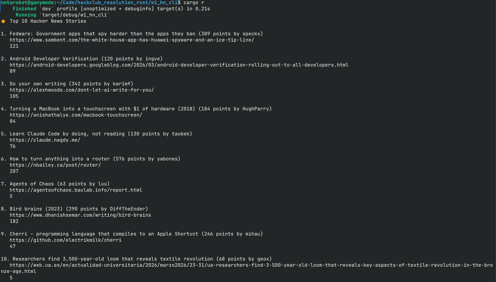

# Hacker News CLI

This is my Week 1 submission for [Hack Club Resolution Rust](https://rust.resolution.hackclub.com/).

## Features
- The base Hacker News CLI shown in the example
- Challenge 1 done: The comment count is shown.
- Challenge 3 done: `Result` and `?` are used, along with the `color-eyre` library

## Screenshot

## Downloading
Download this program <a href="releases/latest">in GitHub Releases</a>.
